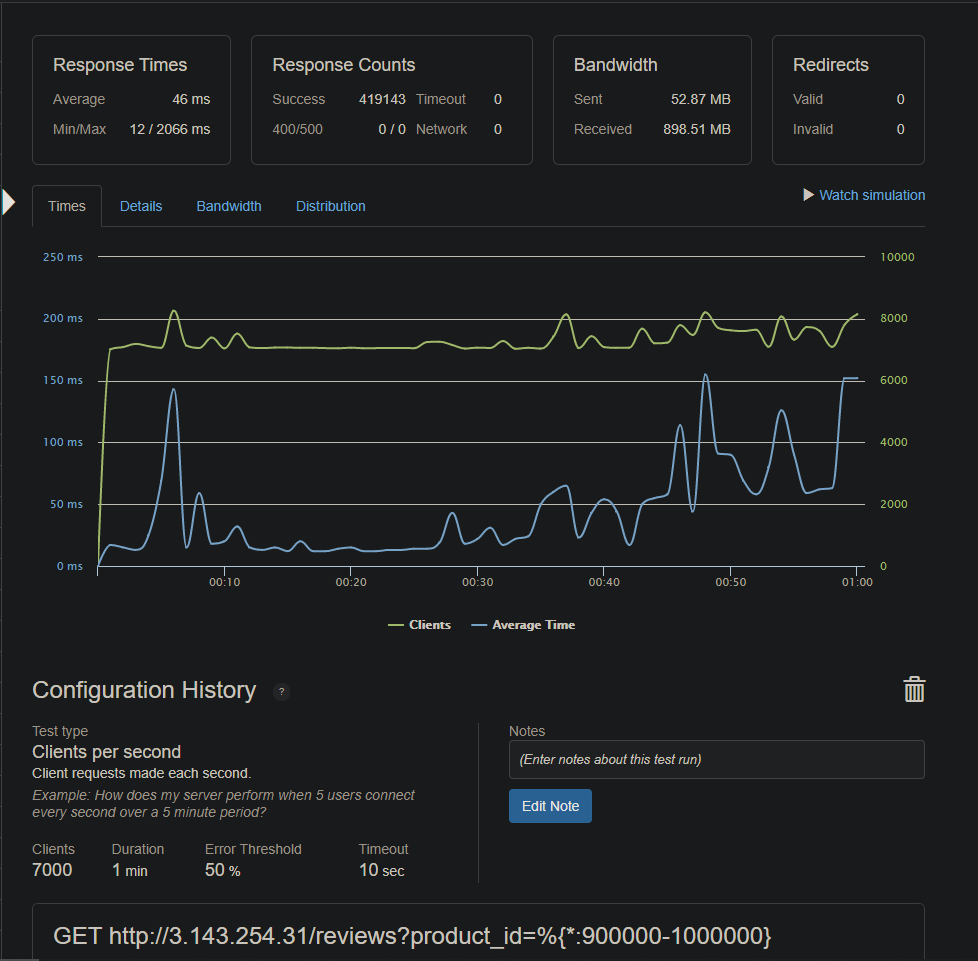

# E-Commerce Ratings & Reviews Service
Part of a team tasked with building scalable microservices that replaced the legacy monolithic API for an [e-commerce platform](https://github.com/hr-rfp55-aang/project-catwalk) to handle the increase in growing traffic. This is for the reviews section of the API and was stress tested using only EC2 t2.micro instances.

## Project Accomplishments
- Seeded a PostgreSQL database with over ~35 million records
- Optimized raw SQL query execution times to average < 1ms per query using indexes, joins and PostgreSQL JSON functions
- Locally optimized to 1000 requests per second with <20 ms latency
- Improved throughput to 7000 requests per second with <50 ms latency and 0% error rate when deployed and horizontally scaled
- Used total of four EC2 t2.micro instances:
  - One instance hosting Postgres database
  - One instance running NGINX with least connections load balancing and caching enabled.
  - Two instances running the node server with the API

### Built With

